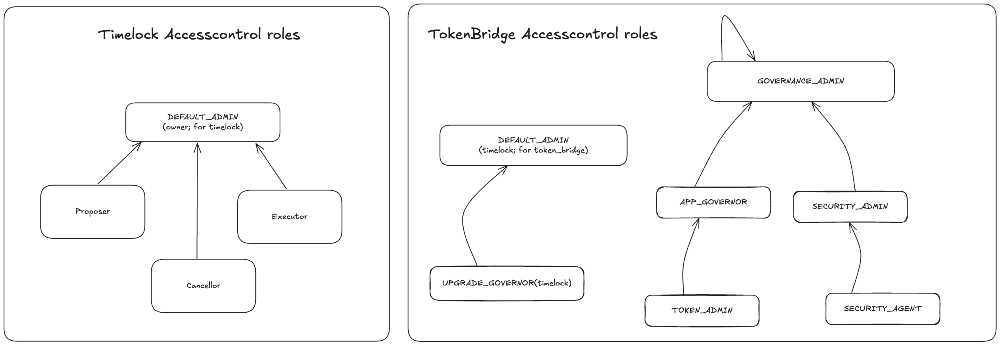

# Starknet Bridge
`starknet_bridge` are the bridges that can be used by the appchains that will deployed using Starknet [Madara](https://github.com/madara-alliance/madara) stack

This repository contains the code for the L2<>L3 bridges that can be used to bridge funds between an appchain and Starknet. This is similar to [starkgate](https://github.com/starknet-io/starkgate-contracts) which contains the bridge contracts between Ethereum and Starknet.

## Architecture
- `token_bridge.cairo`: The bridge that will be deployed on Starknet. Users can use this bridge to add tokens and deposit and withdraw funds.
- `withdrawal_limit/component.cairo`: A component used to manage the withdrawal limits for token that have this feature enabled.

The bridge relies on the core messaging contract from [piltover](https://github.com/keep-starknet-strange/piltover) which is the Cairo version of the Starknet Core Contracts.

## Access Control
The bridge implements a hierarchical access control system with different roles for flexibility. This does not complicate the system, 
if some roles feel unnecessary just dont use them given proper setup has been done.

### Timelock Access Control
The Timelock contract has a DEFAULT_ADMIN role (owner) which manages three roles:
- Proposer: Can propose new operations
- Executor: Can execute operations after the timelock period
- Canceller: Can cancel proposed operations

### TokenBridge Access Control
The TokenBridge has a more complex role hierarchy:
- GOVERNANCE_ADMIN: Top-level admin role
- APP_GOVERNOR: Manages TOKEN_ADMIN role
- SECURITY_ADMIN: Manages SECURITY_AGENT role
- TOKEN_ADMIN: Handles token-related operations
- SECURITY_AGENT: Handles security-related operations

The UPGRADE_GOVERNOR role is exclusively assigned to the Timelock contract, ensuring all upgrades go through a predefined delay period for enhanced security.



## Build
To build the project run: 
```shell
scarb build
```

## Test
To run the testcases of the project run: 
```shell
scarb test
```
