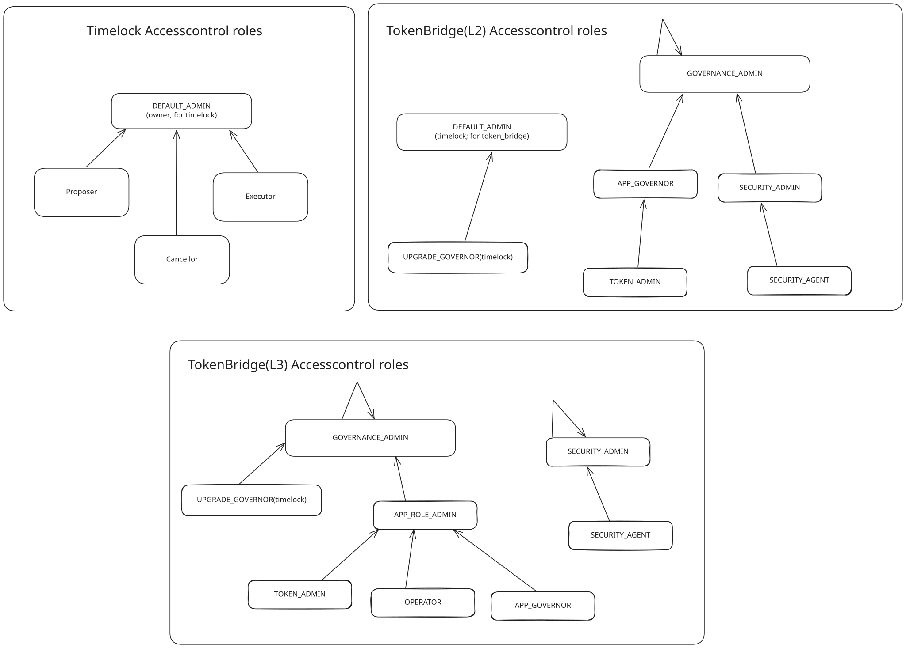
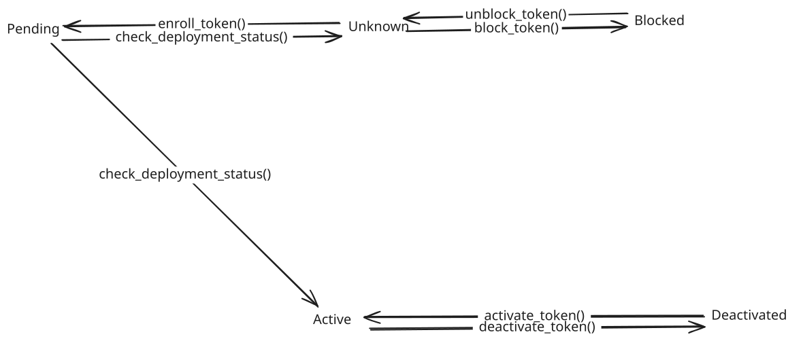

# Starknet Bridge
`starknet_bridge` are the bridges that can be used by the appchains that will be deployed using Starknet [Madara](https://github.com/madara-alliance/madara) stack.

This repository contains the code for the L2<>L3 bridges that can be used to bridge funds between an appchain and Starknet. This is similar to [starkgate](https://github.com/starknet-io/starkgate-contracts) which contains the bridge contracts between Ethereum and Starknet.

## Build
To build the project, run: 
```shell
scarb build
```

## Test
To run the test cases of the project, run: 
```shell
scarb test
```

## Architecture
- `token_bridge.cairo`: The bridge that will be deployed on Starknet. Users can use this bridge to add tokens and deposit and withdraw funds.
- `withdrawal_limit/component.cairo`: A component used to manage the withdrawal limits for tokens that have this feature enabled.

The bridge relies on the core messaging contract from [piltover](https://github.com/keep-starknet-strange/piltover) which is the Cairo version of the Starknet Core Contracts.

## Access Control
The bridge implements a hierarchical access control system with different roles for flexibility. While the system offers multiple roles, you can choose to use only the roles that are necessary for your specific implementation after proper setup.

### TokenBridge Access Control
The TokenBridge has the following role hierarchy:
- GOVERNANCE_ADMIN: Top-level admin role
- APP_GOVERNOR: Manages TOKEN_ADMIN role
- SECURITY_ADMIN: Manages SECURITY_AGENT role
- TOKEN_ADMIN: Handles token-related operations
- SECURITY_AGENT: Handles security-related operations
- UPGRADE_GOVERNOR: Ability to upgrade the token bridge.

| Role | Role Admin |
|------|------------|
| UPGRADE_GOVERNOR | DEFAULT_ADMIN |
| GOVERNANCE_ADMIN | GOVERNANCE_ADMIN |
| APP_GOVERNOR | GOVERNANCE_ADMIN |
| SECURITY_ADMIN | GOVERNANCE_ADMIN |
| SECURITY_AGENT | SECURITY_ADMIN |
| TOKEN_ADMIN | APP_GOVERNOR |

Note: The admin for the UPGRADE_GOVERNOR role is held by the timelock contract only, which means that only the timelock can add/remove more UPGRADE_GOVERNOR roles.

### Timelock Access Control
The Timelock contract maintains its own access control with a DEFAULT_ADMIN role (owner) which manages three roles:
- Proposer: Can propose new operations
- Executor: Can execute operations after the timelock period
- Canceller: Can cancel proposed operations

The UPGRADE_GOVERNOR role is exclusively assigned to the Timelock contract, ensuring all upgrades go through a predefined delay period for enhanced security.



## Functions by Role
The TokenBridge contract implements role-based access control for various functions. Below is a comprehensive list of functions that each role can call:

### UPGRADE_GOVERNOR
- `upgrade` - Can upgrade the token bridge contract to a new implementation

### APP_GOVERNOR
- `set_appchain_token_bridge` - Can set the appchain bridge address
- `set_max_total_balance` - Can set the maximum total balance for a token
- `configure_permissionless_enrollment` - Can configure whether token enrollment is permissionless or requires TOKEN_ADMIN role

### SECURITY_ADMIN
- `increase_withdrawal_limit` - Can increase the daily withdrawal limit percentage for a token
- `disable_withdrawal_limit` - Can disable withdrawal limits by setting them to 100%
- `unpause` - Can unpause the contract after it has been paused

### SECURITY_AGENT
- `decrease_withdrawal_limit` - Can decrease the daily withdrawal limit percentage for a token
- `pause` - Can pause the contract in emergency situations

### TOKEN_ADMIN
- `block_token` - Can block unknown tokens from being enrolled
- `unblock_token` - Can unblock tokens that were previously blocked
- `deactivate_token` - Can deactivate active tokens
- `reactivate_token` - Can reactivate previously deactivated tokens

### Public Functions (No Role Required)
The following functions are publicly accessible without requiring any specific role:
- `enroll_token` - Initiates token enrollment (Note: This function's accessibility depends on the bridge's configuration. By default, token enrollment is permissionless (anyone can call it). If `permissioned_enroll` is set to true, only TOKEN_ADMIN can call this function. The APP_GOVERNOR can configure this setting using `configure_permissionless_enrollment` function)
- `deposit` - Deposits tokens
- `deposit_with_message` - Deposits tokens with a message
- `withdraw` - Withdraws tokens
- `deposit_cancel_request` - Requests to cancel a deposit
- `deposit_with_message_cancel_request` - Requests to cancel a deposit with message
- `deposit_reclaim` - Reclaims a cancelled deposit
- `deposit_with_message_reclaim` - Reclaims a cancelled deposit with message
- `get_status` - Checks a token's status
- `is_servicing_token` - Checks if a token is being serviced
- `get_max_total_balance` - Checks the maximum total balance for a token
- `get_appchain_token_bridge` - Gets the appchain bridge address
- `appchain_bridge` - Gets the appchain bridge address
- `get_identity` - Gets the contract identity
- `get_version` - Gets the contract version

## Token Status Flow
The token bridge implements a state machine for token status management. The following diagram illustrates how token status can change:



Token status transitions:
- **Unknown → Pending**: When a token enrollment is initiated
- **Pending → Active**: When a token is successfully enrolled and activated in the bridge
- **Active → Deactivated**: When a token is deactivated by the TOKEN_ADMIN
- **Deactivated → Active**: When a token is reactivated by the TOKEN_ADMIN
- **Unknown → Blocked**: When a token is blocked by the TOKEN_ADMIN
- **Blocked → Unknown**: When a token is unblocked by the TOKEN_ADMIN